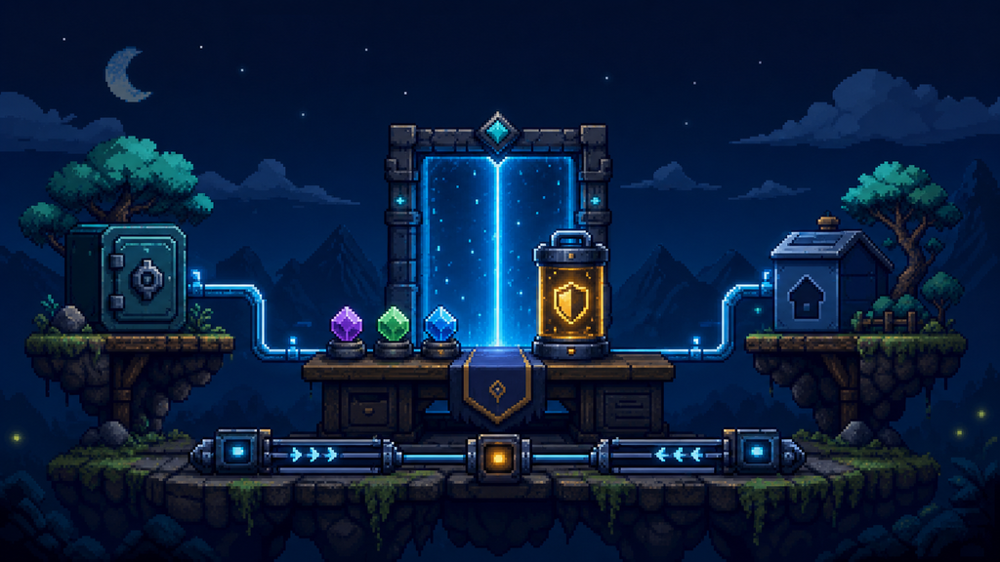
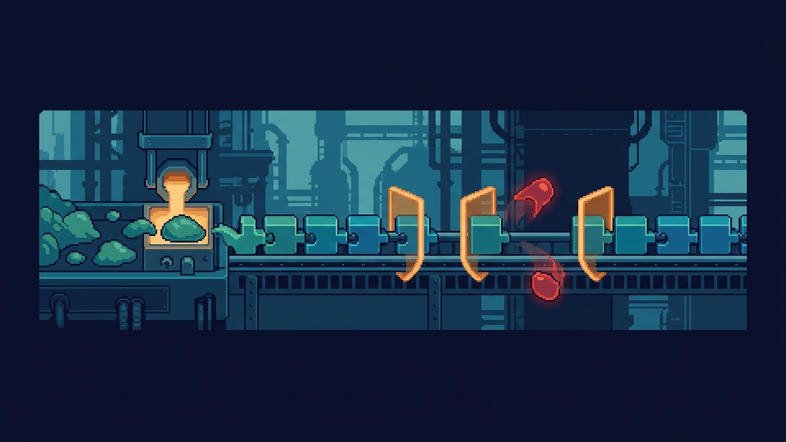
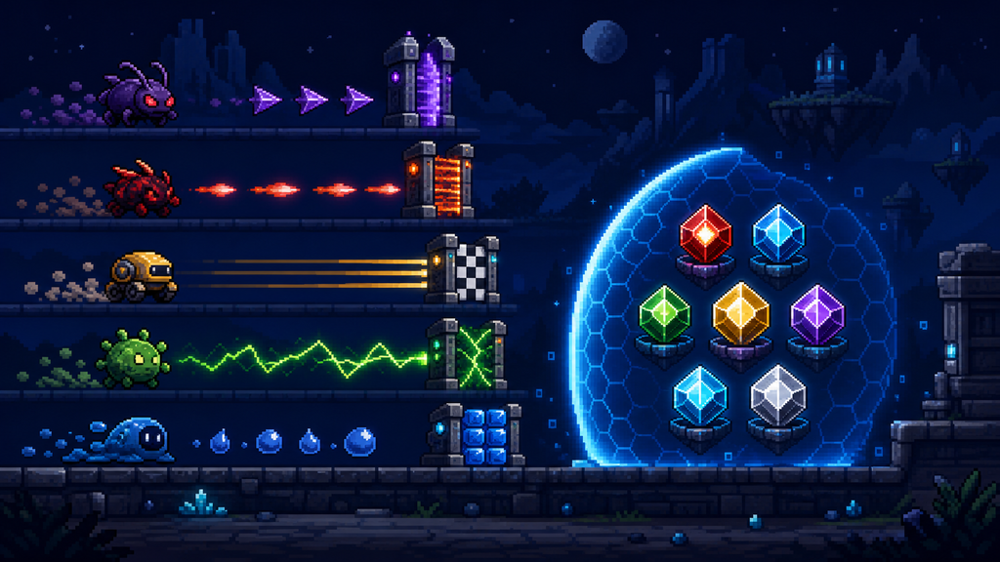
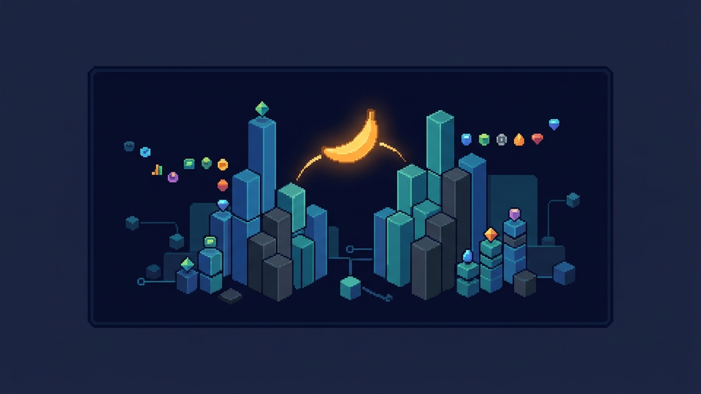
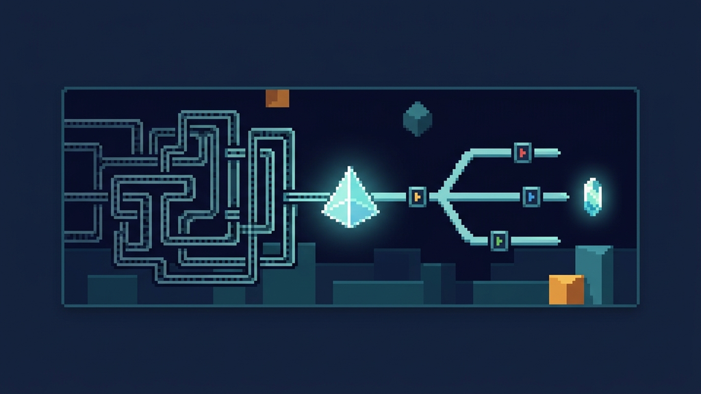
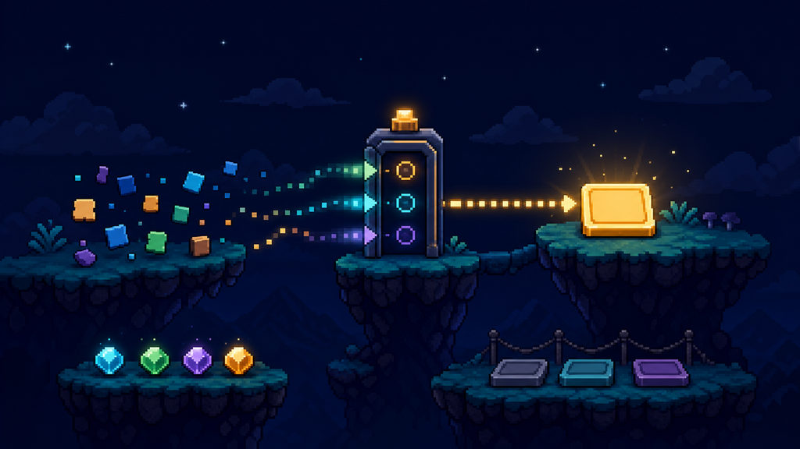

# Skills

An installable collection of skills I find useful: engineering discipline, testing, agent workflows, writing and research, creative media, practical productivity, and a few playful detours. Each skill keeps its own purpose and detailed instructions while sharing one discovery and validation system.

Skills describe useful outcomes and real boundaries, leaving capable models room to choose their approach. Templates and style defaults are starting points, not universal requirements. When guidance becomes stale, skills consult relevant official or trusted sources and propose a correction to the canonical package rather than silently rewriting installed copies.

The category structure takes inspiration from [Matt Pocock's skills repository](https://github.com/mattpocock/skills), without copying its voice or skill prose.

Contributing? Start with the conventions and validation workflow in [AGENTS.md](AGENTS.md).

## Quick install

Install the full collection into the current project (the default):

```bash
npx skills add jpcaparas/skills
```

Install it globally only when you want the skills available across projects:

```bash
npx skills add jpcaparas/skills --global
```

For one skill, use the exact command beside its card below. To install a category, target its directory, for example `npx skills add jpcaparas/skills/skills/engineering`. Categories organise the repository; they are not invocation prefixes, and every existing `--skill` name remains stable. `SKILL.md` is the source of truth for each skill.

## Find a starting point

- Hardening a codebase? Start with `maintainable-code`, `strong-types`, and `adversarial-test-sweep`.
- Orienting yourself before a change? Try `zoom-out`, `eli12`, or `product-question`.
- Turning source material into something useful? Try `youtube-transcript-dossier`, `better-writing`, or `to-diagram`.
- Building visual output? Explore `interface-design-taste`, `nanobanana-infographic`, or `oneshot-websites`.

## Category map

- [Engineering](#engineering) · [`skills/engineering/`](skills/engineering/)
- [Testing](#testing) · [`skills/testing/`](skills/testing/)
- [Agents](#agents) · [`skills/agents/`](skills/agents/)
- [Writing](#writing) · [`skills/writing/`](skills/writing/)
- [Research](#research) · [`skills/research/`](skills/research/)
- [Creative](#creative) · [`skills/creative/`](skills/creative/)
- [Productivity](#productivity) · [`skills/productivity/`](skills/productivity/)
- [Fun](#fun) · [`skills/fun/`](skills/fun/)

## Available Skills

### Engineering

#### `better-chezmoi`

`npx skills add jpcaparas/skills --skill better-chezmoi`

<p align="center">
  
</p>

Safe, version-aware chezmoi workflows for daily dotfile work, multi-machine templates, secrets, recovery, and searchable current official documentation.

#### `eli12`

`npx skills add jpcaparas/skills --skill eli12`

<p align="center">
  
</p>

Production skill for surgically explaining codebases, subsystems, and feature flows in accessible language, using grounded real-world analogies and concrete file anchors without flattening the technical truth.

#### `heuristic-to-deterministic`

`npx skills add jpcaparas/skills --skill heuristic-to-deterministic`

<p align="center">
  
</p>

Production skill for turning session learnings, repeated heuristics, and manual review habits into deterministic scripts, validators, normalizers, fixtures, CI checks, and hook-ready workflows that future agents can reuse instead of guessing.

#### `implicit-token-savings`

`npx skills add jpcaparas/skills --skill implicit-token-savings`

<p align="center">
  
</p>

Production skill for minimizing context burn during coding sessions by preferring compact filesystem, git, test, and container commands, with verified local probes and clean fallbacks when preferred binaries are absent.

#### `jev-opportunities`

`npx skills add jpcaparas/skills --skill jev-opportunities`

<p align="center">
  
</p>

Explicitly invoked audits for applications without Jev: scrape live documentation, find cost reductions, fast paths, adjudication and other semantic decision opportunities, then measure permission-gated spikes against the existing implementation.

#### `maintainable-code`

`npx skills add jpcaparas/skills --skill maintainable-code`

<p align="center">
  
</p>

Passive production skill for keeping generated code maintainable, properly decomposed, strongly typed where the codebase supports it, resilient to production failures (jobs, queues, retries, observability), and easy to isolate in tests through replaceable dependency boundaries.

#### `ripgrep`

`npx skills add jpcaparas/skills --skill ripgrep`

<p align="center">
  
</p>

Production skill for making `rg` the default search tool instead of `grep`, covering recursive text search, ignore-aware filename discovery via `rg --files`, config files, machine-readable output, and verified edge cases around globs, hidden files, multiline search, and PCRE2.

#### `strong-types`

`npx skills add jpcaparas/skills --skill strong-types`

<p align="center">
  
</p>

Passive always-on skill that eliminates type ambiguity — blind `??`/`||` fallback chains, `any`/`mixed` escape hatches, untyped signatures, and magic arrays — in any language with a usable type system, with per-language golden references and a heuristic ambiguity scanner, while deliberately not forcing typing onto languages that lack it.

#### `zoom-out`

`npx skills add jpcaparas/skills --skill zoom-out`

<p align="center">
  
</p>

Production skill for mapping unfamiliar code one layer up, covering relevant modules, callers, callees, entrypoints, boundaries, dependencies, evidence labels, unknowns, and concise next-read lists before editing or detailed explanation.

### Testing

#### `adversarial-test-sweep`

`npx skills add jpcaparas/skills --skill adversarial-test-sweep`

<p align="center">
  
</p>

Language-agnostic adversarial test hardening that builds a bounded risk ledger, attacks malformed input, state, concurrency, dependency, and resource failures, strengthens weak or flaky oracles, prunes only with comparative evidence, and preserves every confirmed defect as a replayable regression.

#### `maintainable-tests`

`npx skills add jpcaparas/skills --skill maintainable-tests`

<p align="center">
  
</p>

Passive production skill for writing and reviewing tests that read as living documentation, cover meaningful edge cases, explain legacy behavior, and stay maintainable for future developers.

### Agents

#### `bootstrap-agents-md`

`npx skills add jpcaparas/skills --skill bootstrap-agents-md`

<p align="center">
  
</p>

Production skill for creating or replacing minimal, evidence-backed root agent guidance and an exact Claude import while preserving project-specific truth and capable-model judgment.

#### `scaffold-github-cloud-agent-environment`

`npx skills add jpcaparas/skills --skill scaffold-github-cloud-agent-environment`

<p align="center">
  
</p>

Production scaffold-and-doctor skill for GitHub Copilot cloud agent environments that audits the repo, verifies the live GitHub Docs contract, and scaffolds or repairs `.github/workflows/copilot-setup-steps.yml` while separating repo-local fixes from GitHub settings changes.

#### `scaffold-hooks`

`npx skills add jpcaparas/skills --skill scaffold-hooks`

<p align="center">
  
</p>

Universal `/scaffold-hooks` skill — the single hooks scaffolder for Claude Code, Codex, GitHub Copilot, Devin CLI, and OpenCode. Bundles each harness as a self-contained component, asks which harnesses to target (default all), writes one shared `hooks/` ports-and-adapters layout, and migrates legacy generated hook roots without colliding with custom hooks.

#### `secure-ai-agent-coding`

`npx skills add jpcaparas/skills --skill secure-ai-agent-coding`

<p align="center">
  
</p>

Production skill for building, reviewing, and hardening AI agents, LLM applications, RAG systems, tool-calling workflows, and AI coding agents with secure-by-default controls, progressive review references, and a heuristic dangerous-pattern scanner.

#### `skill-creator-advanced`

`npx skills add jpcaparas/skills --skill skill-creator-advanced`

<p align="center">
  
</p>

Outcome-led skill creator and library curator with optional blueprints, precise invocation, progressive disclosure, proportional verification, creative-alternative evals, evergreen source recovery, and consistent lifecycle updates.

### Writing

#### `azure-devops-wiki-markdown`

`npx skills add jpcaparas/skills --skill azure-devops-wiki-markdown`

<p align="center">
  
</p>

Production skill for Azure DevOps wiki Markdown covering wiki-only blocks, Mermaid-safe authoring, code-fence language identifiers, and surface-specific support differences across Wiki, PR, README, Widget, and Done fields.

#### `better-writing`

`npx skills add jpcaparas/skills --skill better-writing`

<p align="center">
  
</p>

Production writing system for drafting, rewriting, review, humanisation, and adaptation, with source-fidelity gates, publication-informed structural examples, long-prose digestibility, voice preservation, and a calibrated corpus of AI-like writing signals that never claims to determine authorship.

#### `client-report-from-commits`

`npx skills add jpcaparas/skills --skill client-report-from-commits`

<p align="center">
  
</p>

Production skill for turning git commits and diffs since a resolved date into a feature-grouped client update, with evidence-backed date handling, repository checks, and a format suited to the audience.

#### `repository-readme-writer`

`npx skills add jpcaparas/skills --skill repository-readme-writer`

<p align="center">
  
</p>

Production skill for creating and improving concise repository READMEs with first-use guidance suited to the project, repository-grounded commands, version-source guidance, and agent-safe wording that avoids brittle path inventories.

#### `simplified-technical-english`

`npx skills add jpcaparas/skills --skill simplified-technical-english`

<p align="center">
  
</p>

Production skill for reference-backed or clearly bounded ASD-STE100 Issue 9 rewrites and audits of technical procedures, descriptions, and safety instructions, with terminology governance, protected-literal fidelity, and no unsupported certification claims.

### Research

#### `google-search-ai-optimization`

`npx skills add jpcaparas/skills --skill google-search-ai-optimization`

<p align="center">
  
</p>

Production skill for implementing Google-grounded SEO/GEO optimization in web development, covering Search generative AI features, crawlability, indexability, snippets, structured data, content quality, ecommerce/local details, and agentic website readiness without unsupported AI-search hacks.

#### `isitagentready`

`npx skills add jpcaparas/skills --skill isitagentready`

<p align="center">
  
</p>

Production skill for auditing repository agent readiness against Cloudflare's signals, combining scoped source and runtime evidence, optional official scan capture, and optional deterministic Markdown report packets.

#### `markdown-new`

`npx skills add jpcaparas/skills --skill markdown-new`

<p align="center">
  
</p>

Production skill for markdown.new covering URL-to-Markdown conversion, file conversion, crawl jobs, the hosted editor, and live-tested edge cases.

#### `seo-analysis`

`npx skills add jpcaparas/skills --skill seo-analysis`

<p align="center">
  
</p>

Production skill for framework-agnostic SEO analysis of real codebases, covering crawlability, rendering, canonicals, robots directives, sitemaps, metadata, OG and social previews, structured data, information architecture, and AI-era search readiness, with a deterministic handoff prompt for another session to implement fixes.

#### `synthetic-search`

`npx skills add jpcaparas/skills --skill synthetic-search`

<p align="center">
  
</p>

Production skill for Synthetic Search covering raw `curl`/`jq` search flows, quota checks, a zero-dependency Node helper, and live-tested API quirks.

#### `temporal-awareness`

`npx skills add jpcaparas/skills --skill temporal-awareness`

<p align="center">
  
</p>

Production skill for grounding a session in real system time and timezone, triaging whether a prompt needs live verification, converting relative dates into absolute dates, and avoiding stale-memory answers for models, prices, schedules, laws, and other volatile facts.

#### `youtube-transcript-dossier`

`npx skills add jpcaparas/skills --skill youtube-transcript-dossier`

<p align="center">
  
</p>

Production skill for converting YouTube video transcripts into structured dossiers with timestamped key topics, notable quotes, takeaways, and follow-up items. Fetches metadata via yt-dlp and transcripts via youtube-transcript-api, with language preference, cookie-based auth for restricted videos, and JSON/text/VTT output formats.

### Creative

#### `interface-design-taste`

`npx skills add jpcaparas/skills --skill interface-design-taste`

<p align="center">
  
</p>

Production skill for shaping web, app, and desktop interfaces with stronger hierarchy, cleaner typography, tighter color and surface systems, platform-aware interaction design, and redesign-first critique workflows that avoid generic AI UI defaults.

#### `nanobanana-infographic`

`npx skills add jpcaparas/skills --skill nanobanana-infographic`

<p align="center">
  
</p>

Production skill for Nano Banana 2 infographic prompting and verification, with optional low-noise presets, brief-led format and art direction, and live Gemini image API probes for executive and editorial visuals.

#### `oneshot-websites`

`npx skills add jpcaparas/skills --skill oneshot-websites`

<p align="center">
  
</p>

Production skill for launching one-shot website experiments through fresh isolated subagents, with a 100-prompt catalogue, same-prompt replicas, prompt provenance, and local-only static handoffs. It asks whether to run the existing gauntlet; declining produces generation-only output explicitly marked UNVERIFIED, without artifact or workspace checks.

#### `to-diagram`

`npx skills add jpcaparas/skills --skill to-diagram`

<p align="center">
  
</p>

General-purpose process-modeling skill that turns convoluted engineering, scientific, and everyday concepts into one clear Mermaid diagram with matching Markdown source and a verified PNG export.

### Productivity

#### `adhd-friendly`

`npx skills add jpcaparas/skills --skill adhd-friendly`

<p align="center">
  
</p>

Portable ADHD-friendly communication and task support that reduces activation and working-state friction while preserving completeness, safety, user autonomy, and requested depth.

#### `azure-devops-create-work-item`

`npx skills add jpcaparas/skills --skill azure-devops-create-work-item`

<p align="center">
  
</p>

Production skill for drafting local Azure DevOps work item packets from loose context, using official Azure Boards work item primitives and reusable templates for Agile epics, features, user stories, tasks, issues, and bugs.

#### `devils-advocate`

`npx skills add jpcaparas/skills --skill devils-advocate`

<p align="center">
  
</p>

Actively invoked devil's-advocate skill that steelmans an idea, argues the strongest honest opposing case, cross-examines assumptions, concedes successful rebuttals, and identifies the evidence that would settle the debate.

#### `product-question`

`npx skills add jpcaparas/skills --skill product-question`

<p align="center">
  
</p>

Production skill for answering product, PM, and stakeholder questions about app behavior by inspecting the codebase and returning concise share-ready plain-English responses for email, Teams, Slack, or product docs.

#### `travel-plan-spreadsheet-generator`

`npx skills add jpcaparas/skills --skill travel-plan-spreadsheet-generator`

<p align="center">
  
</p>

Production skill for turning messy travel notes, PDFs, screenshots, shopping asks, and fixed commitments into a polished `.xlsx` travel itinerary workbook with bookings, daily plans, prep/compliance tracking, pack and buy lists, source logging, and visible review flags.

### Fun

#### `oneshot-timeline`

`npx skills add jpcaparas/skills --skill oneshot-timeline`

<p align="center">
  
</p>

Creates accessible, entertaining timeline websites through source-backed storytelling and topic-led visual design, with optional pastel and editorial-collage starting points. Each topic has one editable workspace and one portable artifact.
