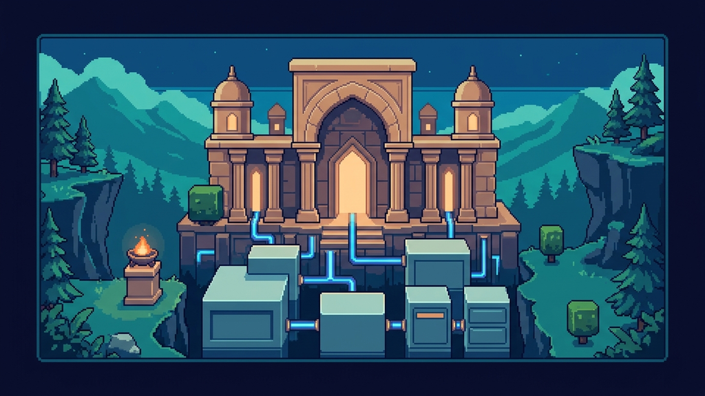
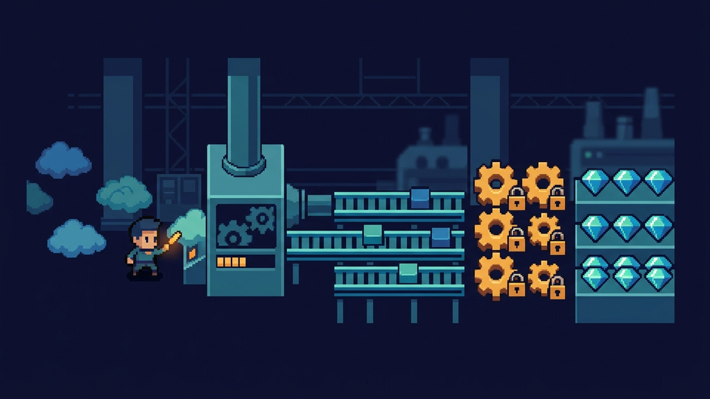
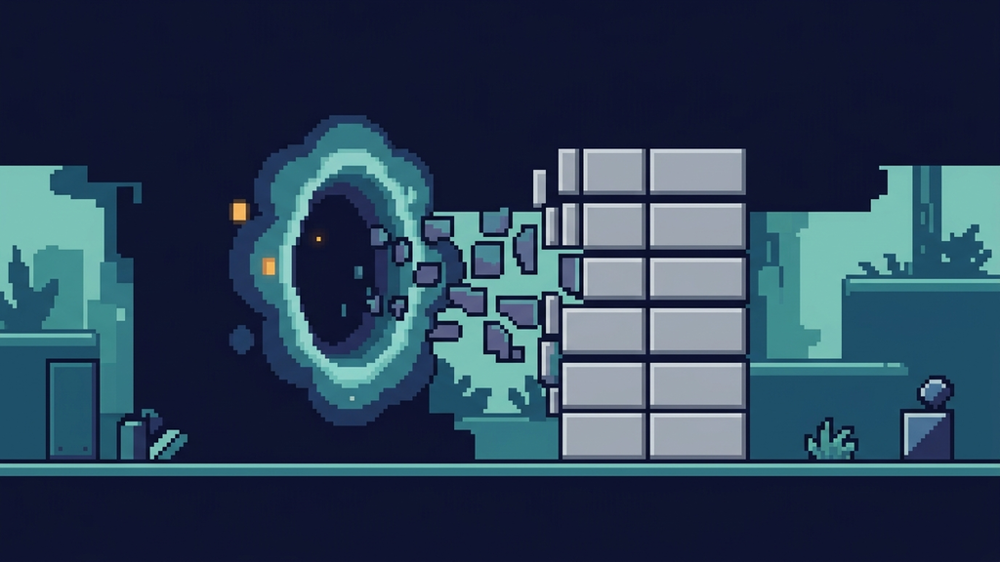
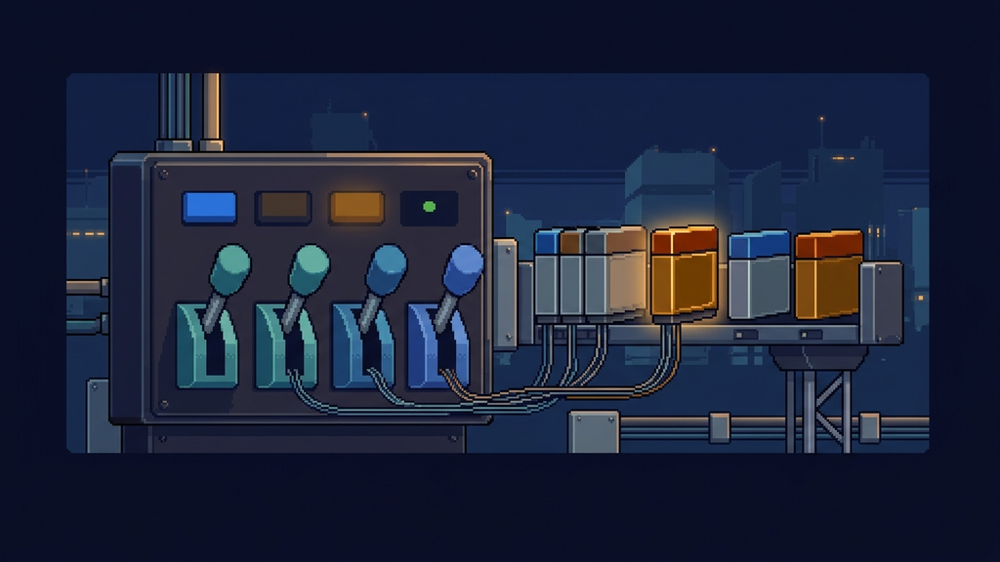

# Skills

Public source repository for installable agent skills.

Install the full collection globally with `npx skills add jpcaparas/skills`.

## Install

```bash
npx skills add jpcaparas/skills
```

## Available Skills

### `audify`

`npx skills add jpcaparas/skills --skill audify`

<p align="center">
  
</p>

Production skill for turning readable URLs, files, and raw text into cleaned Gemini 3.1 Flash TTS narration, with markup stripping, default MP3 bundle output, and fail-fast prerequisite checks.

### `azure-devops-wiki-markdown`

`npx skills add jpcaparas/skills --skill azure-devops-wiki-markdown`

<p align="center">
  
</p>

Production skill for Azure DevOps wiki Markdown covering wiki-only blocks, Mermaid-safe authoring, code-fence language identifiers, and surface-specific support differences across Wiki, PR, README, Widget, and Done fields.

### `azure-devops-create-work-item`

`npx skills add jpcaparas/skills --skill azure-devops-create-work-item`

<p align="center">
  
</p>

Production skill for drafting local Azure DevOps work item packets from loose context, using official Azure Boards work item primitives and reusable templates for Agile epics, features, user stories, tasks, issues, and bugs.

### `better-writing`

`npx skills add jpcaparas/skills --skill better-writing`

<p align="center">
  
</p>

Production writing skill that starts from Strunk's durable rules, then extends them with progressive disclosure, staged revision passes, cadence repair, genre routing, and bundled style families for technical, analytical, editorial, reflective, and conversion writing.

### `client-report-from-commits`

`npx skills add jpcaparas/skills --skill client-report-from-commits`

<p align="center">
  
</p>

Production skill for turning git commits and diffs since an exact date into a feature-grouped, non-technical client update, with strict date handling and repository checks.

### `eli12`

`npx skills add jpcaparas/skills --skill eli12`

<p align="center">
  
</p>

Production skill for surgically explaining codebases, subsystems, and feature flows in accessible language, using grounded real-world analogies and concrete file anchors without flattening the technical truth.

### `google-search-ai-optimization`

`npx skills add jpcaparas/skills --skill google-search-ai-optimization`

<p align="center">
  
</p>

Production skill for implementing Google-grounded SEO/GEO optimization in web development, covering Search generative AI features, crawlability, indexability, snippets, structured data, content quality, ecommerce/local details, and agentic website readiness without unsupported AI-search hacks.

### `heuristic-to-deterministic`

`npx skills add jpcaparas/skills --skill heuristic-to-deterministic`

<p align="center">
  
</p>

Production skill for turning session learnings, repeated heuristics, and manual review habits into deterministic scripts, validators, normalizers, fixtures, CI checks, and hook-ready workflows that future agents can reuse instead of guessing.

### `implicit-token-savings`

`npx skills add jpcaparas/skills --skill implicit-token-savings`

<p align="center">
  
</p>

Production skill for minimizing context burn during coding sessions by preferring compact filesystem, git, test, and container commands, with verified local probes and clean fallbacks when preferred binaries are absent.

### `instagram-replicate`

`npx skills add jpcaparas/skills --skill instagram-replicate`

<p align="center">
  
</p>

Production skill for deterministically rebuilding a public Instagram video post or reel into a rerenderable local build with a frozen snapshot, local assets, MP4 output, and a companion GIF capped under 24 MB.

### `isitagentready`

`npx skills add jpcaparas/skills --skill isitagentready`

<p align="center">
  
</p>

Production skill for auditing a live repository against Cloudflare's agent-readiness signals, combining browser-first runtime verification, repository inspection, optional official scan capture, and deterministic markdown report-packet generation.

### `interface-design-taste`

`npx skills add jpcaparas/skills --skill interface-design-taste`

<p align="center">
  
</p>

Production skill for shaping web, app, and desktop interfaces with stronger hierarchy, cleaner typography, tighter color and surface systems, platform-aware interaction design, and redesign-first critique workflows that avoid generic AI UI defaults.

### `linkedin-speak`

`npx skills add jpcaparas/skills --skill linkedin-speak`

<p align="center">
  
</p>

Fun production skill for deterministically translating plain English into exaggerated LinkedIn-speak parody, reversing bloated thought-leader posts back into blunt English, and generating Kagi comparison URLs for side-by-side checks.

### `markdown-new`

`npx skills add jpcaparas/skills --skill markdown-new`

<p align="center">
  
</p>

Production skill for markdown.new covering URL-to-Markdown conversion, file conversion, crawl jobs, the hosted editor, and live-tested edge cases.

### `nanobanana-infographic`

`npx skills add jpcaparas/skills --skill nanobanana-infographic`

<p align="center">
  
</p>

Production skill for Nano Banana 2 infographic prompting and verification covering low-noise prompt variants, default `16:9` review sets, terse in-image copy rules, and live Gemini image API probes for executive and editorial visuals.

### `oneshot-websites`

`npx skills add jpcaparas/skills --skill oneshot-websites`

<p align="center">
  
</p>

Production skill for generating semi-deterministic catalogs of parallel one-shot single-file website variants, with a full style repertoire, route-level `PROMPT.md` files, a fairness-aware directory index, and validation scripts.

### `product-question`

`npx skills add jpcaparas/skills --skill product-question`

<p align="center">
  
</p>

Production skill for answering product, PM, and stakeholder questions about app behavior by inspecting the codebase and returning concise share-ready plain-English responses for email, Teams, Slack, or product docs.

### `reading-notes`

`npx skills add jpcaparas/skills --skill reading-notes`

<p align="center">
  
</p>

Production skill for turning supplied resources such as notes, documents, webpages, YouTube videos, transcripts, screenshots, talks, and PDFs into high-level topics, interesting ideas, research leads, open questions, and concrete homework todos.

### `repo-intent-documenter`

`npx skills add jpcaparas/skills --skill repo-intent-documenter`

<p align="center">
  
</p>

Production skill for creating evidence-backed repository intent documents that explain the high-level purpose of a codebase, label certainty, preserve open questions, and give future coding agents a durable briefing.

### `repository-readme-writer`

`npx skills add jpcaparas/skills --skill repository-readme-writer`

<p align="center">
  
</p>

Production skill for creating and improving concise repository READMEs with mandatory quickstarts, stable project orientation, repository-grounded commands, version-source guidance, and agent-safe wording that avoids brittle path inventories.

### `ripgrep`

`npx skills add jpcaparas/skills --skill ripgrep`

<p align="center">
  
</p>

Production skill for making `rg` the default search tool instead of `grep`, covering recursive text search, ignore-aware filename discovery via `rg --files`, config files, machine-readable output, and verified edge cases around globs, hidden files, multiline search, and PCRE2.

### `seo-analysis`

`npx skills add jpcaparas/skills --skill seo-analysis`

<p align="center">
  
</p>

Production skill for framework-agnostic SEO analysis of real codebases, covering crawlability, rendering, canonicals, robots directives, sitemaps, metadata, OG and social previews, structured data, information architecture, and AI-era search readiness, with a deterministic handoff prompt for another session to implement fixes.

### `scaffold-cc-hooks`

`npx skills add jpcaparas/skills --skill scaffold-cc-hooks`

<p align="center">
  
</p>

Production scaffold skill for Claude Code hooks that audits the target project, verifies the live hook docs, and generates a bash-first hook setup with repeatable merge behavior and event coverage.

### `scaffold-codex-hooks`

`npx skills add jpcaparas/skills --skill scaffold-codex-hooks`

<p align="center">
  
</p>

Production scaffold skill for Codex hooks that audits the repo, verifies the live docs and schemas, checks the effective feature flag state, and generates repo-local lifecycle hook scaffolding.

### `scaffold-devin-hooks`

`npx skills add jpcaparas/skills --skill scaffold-devin-hooks`

<p align="center">
  
</p>

Project-aware Devin CLI hook scaffolder that verifies the live Devin docs, audits a repo, and generates a deterministic `.devin/hooks.v1.json` scaffold with exit-code-2 blocking gates, reusable script adapters, merge behavior, and validation helpers.

### `scaffold-github-cloud-agent-environment`

`npx skills add jpcaparas/skills --skill scaffold-github-cloud-agent-environment`

<p align="center">
  
</p>

Production scaffold-and-doctor skill for GitHub Copilot cloud agent environments that audits the repo, verifies the live GitHub Docs contract, and scaffolds or repairs `.github/workflows/copilot-setup-steps.yml` while separating repo-local fixes from GitHub settings changes.

### `scaffold-opencode-hooks`

`npx skills add jpcaparas/skills --skill scaffold-opencode-hooks`

<p align="center">
  
</p>

Production scaffold skill for OpenCode hooks that audits the repo, verifies the live plugin and config docs, inspects existing project-vs-global OpenCode state, and generates a TypeScript-only managed `.opencode/plugins/` scaffold with repeatable config and package merges.

### `secure-ai-agent-coding`

`npx skills add jpcaparas/skills --skill secure-ai-agent-coding`

<p align="center">
  
</p>

Production skill for building, reviewing, and hardening AI agents, LLM applications, RAG systems, tool-calling workflows, and AI coding agents with secure-by-default controls, progressive review references, and a heuristic dangerous-pattern scanner.

### `synthetic-search`

`npx skills add jpcaparas/skills --skill synthetic-search`

<p align="center">
  
</p>

Production skill for Synthetic Search covering raw `curl`/`jq` search flows, quota checks, a zero-dependency Node helper, and live-tested API quirks.

### `skill-creator-advanced`

`npx skills add jpcaparas/skills --skill skill-creator-advanced`

<p align="center">
  
</p>

Production-grade skill creator with progressive disclosure, validation, cross-harness guidance, and path-aware destination inference.

### `tarsier`

`npx skills add jpcaparas/skills --skill tarsier`

<p align="center">
  
</p>

Creative one-shot skill that generates a tarsier riding a bicycle as an SVG, a padded 500x500 PNG, and a markdown transcript in a timestamped output folder.

### `temporal-awareness`

`npx skills add jpcaparas/skills --skill temporal-awareness`

<p align="center">
  
</p>

Production skill for grounding a session in real system time and timezone, triaging whether a prompt needs live verification, converting relative dates into absolute dates, and avoiding stale-memory answers for models, prices, schedules, laws, and other volatile facts.

### `travel-plan-spreadsheet-generator`

`npx skills add jpcaparas/skills --skill travel-plan-spreadsheet-generator`

<p align="center">
  
</p>

Production skill for turning messy travel notes, PDFs, screenshots, shopping asks, and fixed commitments into a polished `.xlsx` travel itinerary workbook with bookings, daily plans, prep/compliance tracking, pack and buy lists, source logging, and visible review flags.

### `tweet-replicate`

`npx skills add jpcaparas/skills --skill tweet-replicate`

<p align="center">
  
</p>

Production skill for deterministically rebuilding a public X/Twitter post into a rerenderable local build with `snapshot.json`, local assets, MP4 output, and a companion GIF capped under 24 MB.

### `zoom-out`

`npx skills add jpcaparas/skills --skill zoom-out`

<p align="center">
  
</p>

Production skill for mapping unfamiliar code one layer up, covering relevant modules, callers, callees, entrypoints, boundaries, dependencies, evidence labels, unknowns, and concise next-read lists before editing or detailed explanation.

## Repository Layout

Installable skills live one level under `skills/` so `npx skills add` and [skills.sh](https://skills.sh) can discover them without special handling.

```text
skills/
  <skill-name>/
    SKILL.md
```

Optional wrapper files such as `README.md`, `AGENTS.md`, and `metadata.json` can live beside `SKILL.md`, but `SKILL.md` remains the authoritative instruction source.
