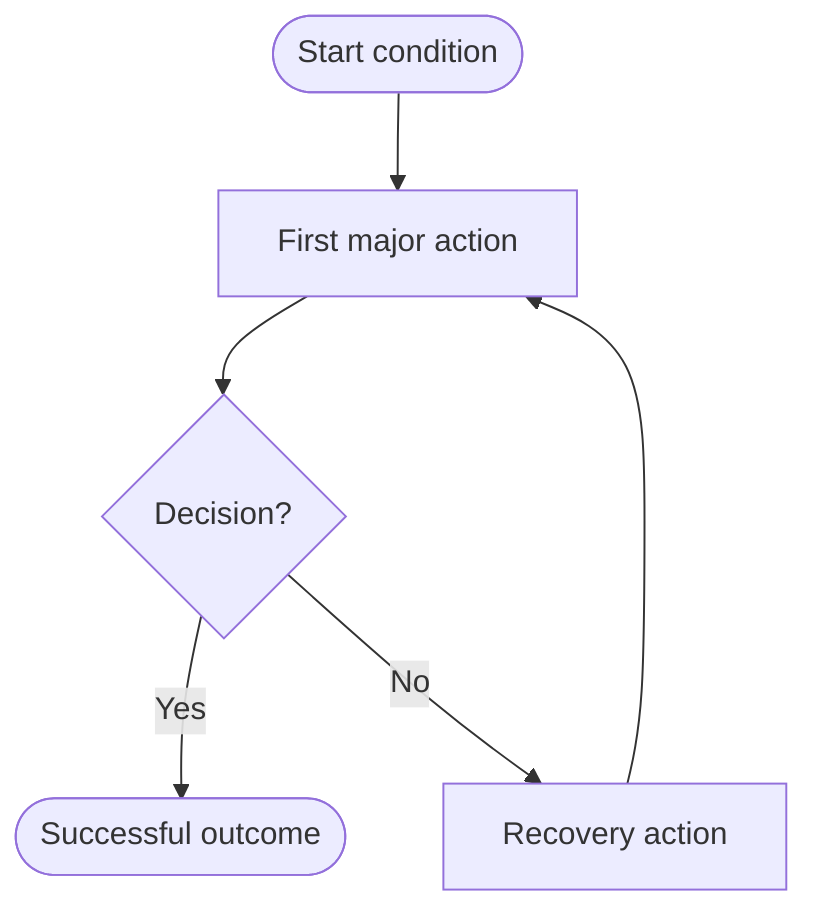

# To Diagram

Make a difficult process easy to understand without silently changing what it means. Produce exactly two durable deliverables from one Mermaid source of truth:

```text
<slug>.md   # explanation plus one fenced Mermaid diagram
<slug>.png  # rendered export of that same Mermaid block
```

## Invocation

```text
/to-diagram <process, concept, source path, or pasted notes>
```

The user may also name an output basename or directory. When they do not, derive a short lowercase kebab-case slug from the subject and write both files in the current working directory. If either candidate path already exists, choose the next free numeric suffix such as `order-flow-2`; do not overwrite unrelated work.

Use this skill for engineering workflows and architecture flows, scientific mechanisms and cycles, business or public processes, operational procedures, and abstract concepts whose relationships are easier to understand visually. Route quantitative comparisons and trends to a charting workflow, image-first editorial graphics to an infographic workflow, and Azure DevOps-specific Mermaid authoring to the Azure DevOps wiki skill.

## Workflow

### 1. Ground the process

Read every source the user supplied or named before drawing. For code-backed flows, inspect the relevant entrypoint, major transitions, side effects, retries, and terminal outcomes. For documents or notes, reconcile duplicated terms and contradictions without inventing missing steps.

Capture the smallest model that preserves the truth:

- purpose and intended audience
- start condition and successful end condition
- actors, systems, or scientific entities
- major stages in order
- decision points and branch outcomes
- feedback loops, retries, and failure exits
- inputs, outputs, and material handoffs
- uncertain, inferred, or omitted relationships

Ask one focused clarification only when two plausible interpretations would produce materially different diagrams. Otherwise proceed with explicit assumptions in the Markdown file.

This step is complete when every shown node and edge is supported by the supplied source, clearly marked as an inference, or recorded as an assumption.

### 2. Choose one diagram grammar

Use one Mermaid diagram, not a gallery.

| Dominant question | Mermaid grammar | Default direction |
| --- | --- | --- |
| What happens, branches, loops, or fails? | `flowchart` | `TD`; use `LR` for a short linear pipeline |
| Who exchanges what, and in what order? | `sequenceDiagram` | Mermaid-managed |
| How does one thing change state? | `stateDiagram-v2` | Mermaid-managed |
| How do causes, stages, or entities form a cycle or mechanism? | `flowchart` with labeled feedback edges | `TD` |

These are common starting points, not a grammar allowlist. Choose the grammar that best answers the user's main comprehension question, not a flowchart by default or a grammar suggested only by a keyword. The renderer passes Mermaid source to the selected CLI rather than restricting diagram types. Before using another grammar, confirm support in that CLI version and verify it through the same rendering and safety checks below.

This step is complete when the diagram has one reading model and no second diagram is needed to understand the main flow.

### 3. Compress without distorting

Design the smallest truthful, readable diagram before authoring Mermaid. Let the content and audience determine granularity, not node, phase, or word quotas:

1. Group details into named phases only when those phases clarify the subject.
2. Keep every node needed to preserve material branches, states, and handoffs; omit detail that does not help the reader's question.
3. Give each action node a concise, concrete label without cutting words needed for accuracy.
4. Give each decision node one question and label every outgoing branch with its outcome.
5. Show only loops and failure paths that change how the process is understood.
6. Move examples, edge-case inventories, evidence, and implementation detail below the diagram in normal Markdown.

For flowcharts, use shapes consistently: rounded nodes for start/end, rectangles for actions, diamonds for decisions, cylinders only for meaningful stored data, and subgraphs for real phases or boundaries. For other grammars, use their native conventions. Shape and text must carry meaning without relying on color alone.

For engineering subjects, preserve trust boundaries, asynchronous handoffs, retry destinations, and terminal failure states when material. For scientific subjects, do not turn correlation into causation; label hypothesized or uncertain links and explain them below. For general concepts, replace unexplained jargon with audience-appropriate language.

This step is complete when a reader can follow the main relationship or path, then find material branches and loops without crossing a maze of arrows.

### 4. Author the Markdown source

Write `<slug>.md` with exactly one fenced `mermaid` block, as required by the renderer, and disclose material assumptions, inferences, and omissions. The following explanation layout is illustrative: adapt or omit headings and bullets to suit the subject, while retaining those disclosures.

````markdown
# <Human-readable title>

<One sentence saying what the diagram explains and where it begins and ends.>



## How to read it

- <Explain relationships or reading conventions that need context.>

## Assumptions and omissions

- <Name any material assumptions, inferred links, or collapsed detail.>
````

Use stable simple node IDs and quote human-facing labels. Keep labels as plain text: no HTML, scripts, click handlers, remote images, remote icon packs, or links. Use a small print-friendly palette only when it adds semantic value; avoid decorative gradients and a different color for every node.

The Markdown explanation and Mermaid block are one source of truth. Do not create a separate `.mmd`, `.svg`, legend image, or intermediate artifact.

This step is complete when the Markdown reads clearly as text, contains exactly one Mermaid block, and names every material assumption or deliberate omission.

### 5. Render the matching PNG

Resolve this skill's installation directory from the loaded `SKILL.md`, then run its renderer:

```bash
python3 <skill-dir>/scripts/render_diagram.py "<slug>.md" "<slug>.png"
```

The renderer extracts the one Mermaid block into temporary storage, invokes Mermaid CLI with a neutral theme, white background, and 2× scale, validates the PNG header and dimensions, then removes its temporary files. It prefers `mmdc` on `PATH` and otherwise uses the compatible package range `@mermaid-js/mermaid-cli@^11` through `npx`.

Use an explicit executable when Mermaid CLI is installed somewhere non-standard:

```bash
python3 <skill-dir>/scripts/render_diagram.py \
  "<slug>.md" "<slug>.png" \
  --mmdc "/path/to/mmdc"
```

The environment variable `TO_DIAGRAM_MMDC` provides the same override. Do not use `--force` unless the user explicitly authorized replacing that PNG; choosing a free basename is the normal path.

If rendering fails, fix the Mermaid source and rerun. Do not substitute a screenshot, hand-authored raster, or unrelated image generator, and do not claim completion with only the Markdown file.

When tool or version guidance conflicts with the installed CLI or is inadequate, check its version/help and official Mermaid/CLI documentation as needed. Use a verified compatible route within existing permissions, preserving the single-source, safety, and no-clobber contracts. Propose a targeted update to the canonical skill with the source and a regression or example; never auto-edit an installed copy. Routine runs need no extra browsing.

This step is complete when the renderer exits zero and reports non-zero PNG dimensions.

### 6. Verify meaning and readability

Verify the deliverables, not merely their existence:

1. Confirm the directory contains the two requested deliverables and no persisted renderer sidecars.
2. Confirm both files are non-empty and the PNG decodes as a raster image.
3. Inspect the PNG with the available image/media viewer at a representative size.
4. Trace every relationship using the chosen grammar; for process diagrams, follow each branch to a terminal outcome or intentional loop.
5. Compare nodes, arrows, labels, and assumptions with the source material.
6. If labels are cramped, arrows cross heavily, or the dominant path is not obvious, simplify the Mermaid and render again.

Visual inspection is required when the harness can display images. When it cannot, report that limitation and still perform source, render, file, and dimension checks.

This step is complete when the PNG is legible, the Markdown and PNG depict the same diagram, and no unsupported certainty was introduced.

### 7. Hand off

Tell the user what the diagram covers and link or list both output paths. Mention assumptions only when they could change interpretation. Keep the handoff short; the durable explanation belongs in the Markdown file.

## Quality Gate

Before finishing, require all applicable answers to be yes:

- Is there exactly one Mermaid block and exactly two durable deliverables?
- Can the main relationship or path be understood before reading the notes?
- Does each decision have labeled outcomes?
- Are loops, retries, uncertainty, and terminal failures shown only when material?
- Are node labels short, concrete, and consistent in abstraction level?
- Are scientific causal claims and engineering implementation claims grounded?
- Did Mermaid CLI successfully render the authored source?
- Was the PNG inspected for clipping, density, contrast, and arrow readability when image viewing was available?

## Helper

- `scripts/render_diagram.py` extracts exactly one Mermaid block from Markdown and renders a validated PNG without leaving source sidecars.
- `scripts/validate.py` validates this installable package and its invocation/eval contracts.
- `scripts/test_skill.py` runs focused renderer and validator regressions without requiring network access.
